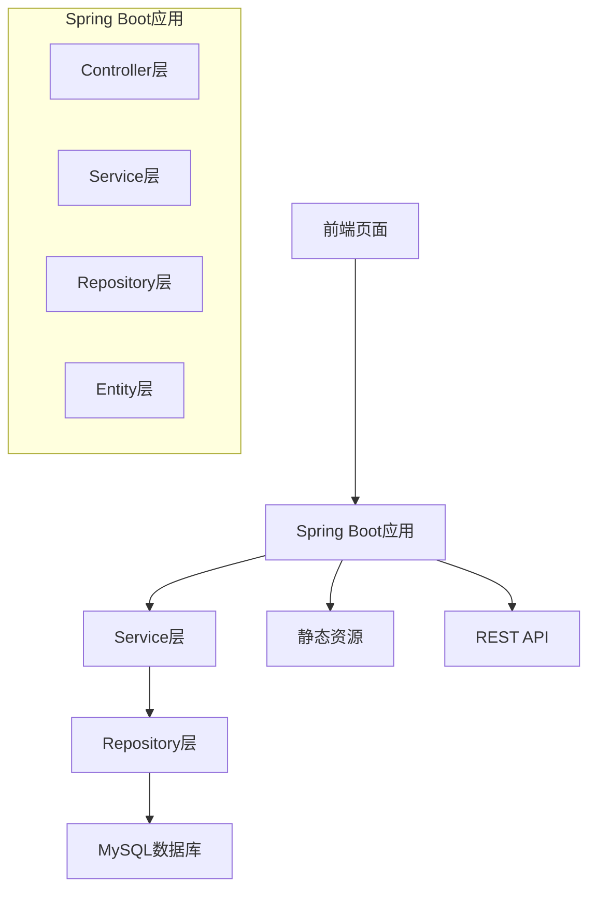

# 设计文档

## 概述

个人博客系统采用经典的三层架构设计，基于Spring Boot框架构建。系统集成前后端，使用MySQL作为数据存储，实现用户管理、博客发布和评论功能。设计遵循RESTful API规范，确保系统的可维护性和扩展性。

## 架构

### 整体架构



### 技术栈

- **后端框架**: Spring Boot 2.x (兼容JDK 1.8)
- **数据库**: MySQL 5.7+
- **ORM框架**: Spring Data JPA + Hibernate
- **安全框架**: Spring Security
- **前端技术**: Thymeleaf模板引擎 + Bootstrap + jQuery
- **构建工具**: Maven
- **数据库连接池**: HikariCP

## 组件和接口

### 核心组件

#### 1. 用户管理组件 (User Management)

**UserController**
- `GET /register` - 显示注册页面
- `POST /register` - 处理用户注册
- `GET /login` - 显示登录页面
- `POST /login` - 处理用户登录
- `GET /profile` - 显示用户资料
- `POST /profile` - 更新用户资料
- `POST /change-password` - 修改密码

**UserService**
- `registerUser(UserDto userDto)` - 用户注册业务逻辑
- `authenticateUser(String username, String password)` - 用户认证
- `updateUserProfile(Long userId, UserDto userDto)` - 更新用户信息
- `changePassword(Long userId, String oldPassword, String newPassword)` - 修改密码

#### 2. 博客管理组件 (Blog Management)

**BlogController**
- `GET /` - 博客首页
- `GET /blog/{id}` - 博客详情页
- `GET /my-blogs` - 我的博客管理页面
- `GET /blog/create` - 创建博客页面
- `POST /blog/create` - 创建博客
- `GET /blog/{id}/edit` - 编辑博客页面
- `POST /blog/{id}/edit` - 更新博客
- `DELETE /blog/{id}` - 删除博客
- `GET /search` - 搜索博客

**BlogService**
- `createBlog(BlogDto blogDto, Long authorId)` - 创建博客
- `updateBlog(Long blogId, BlogDto blogDto, Long authorId)` - 更新博客
- `deleteBlog(Long blogId, Long authorId)` - 删除博客
- `getBlogById(Long blogId)` - 获取博客详情
- `getBlogsByAuthor(Long authorId)` - 获取用户的博客列表
- `getAllBlogs(Pageable pageable)` - 获取所有博客（分页）
- `searchBlogs(String keyword, Pageable pageable)` - 搜索博客

#### 3. 评论管理组件 (Comment Management)

**CommentController**
- `POST /blog/{blogId}/comment` - 添加评论
- `GET /blog/{blogId}/comments` - 获取博客评论
- `DELETE /comment/{id}` - 删除评论（仅作者可删除）

**CommentService**
- `addComment(Long blogId, CommentDto commentDto, Long userId)` - 添加评论
- `getCommentsByBlog(Long blogId)` - 获取博客的所有评论
- `deleteComment(Long commentId, Long userId)` - 删除评论

### API接口规范

#### RESTful API端点

```
用户相关:
POST /api/auth/register     - 用户注册
POST /api/auth/login        - 用户登录
GET  /api/user/profile      - 获取用户信息
PUT  /api/user/profile      - 更新用户信息

博客相关:
GET    /api/blogs           - 获取博客列表
GET    /api/blogs/{id}      - 获取博客详情
POST   /api/blogs           - 创建博客
PUT    /api/blogs/{id}      - 更新博客
DELETE /api/blogs/{id}      - 删除博客
GET    /api/blogs/search    - 搜索博客

评论相关:
GET    /api/blogs/{id}/comments  - 获取博客评论
POST   /api/blogs/{id}/comments  - 添加评论
DELETE /api/comments/{id}        - 删除评论
```

## 数据模型

### 数据库设计

#### 用户表 (users)
```sql
CREATE TABLE users (
    id BIGINT PRIMARY KEY AUTO_INCREMENT,
    username VARCHAR(50) UNIQUE NOT NULL,
    email VARCHAR(100) UNIQUE NOT NULL,
    password VARCHAR(255) NOT NULL,
    display_name VARCHAR(100),
    created_at TIMESTAMP DEFAULT CURRENT_TIMESTAMP,
    updated_at TIMESTAMP DEFAULT CURRENT_TIMESTAMP ON UPDATE CURRENT_TIMESTAMP
);
```

#### 博客表 (blogs)
```sql
CREATE TABLE blogs (
    id BIGINT PRIMARY KEY AUTO_INCREMENT,
    title VARCHAR(200) NOT NULL,
    content TEXT NOT NULL,
    summary VARCHAR(500),
    author_id BIGINT NOT NULL,
    created_at TIMESTAMP DEFAULT CURRENT_TIMESTAMP,
    updated_at TIMESTAMP DEFAULT CURRENT_TIMESTAMP ON UPDATE CURRENT_TIMESTAMP,
    FOREIGN KEY (author_id) REFERENCES users(id) ON DELETE CASCADE
);
```

#### 评论表 (comments)
```sql
CREATE TABLE comments (
    id BIGINT PRIMARY KEY AUTO_INCREMENT,
    content TEXT NOT NULL,
    blog_id BIGINT NOT NULL,
    user_id BIGINT NOT NULL,
    created_at TIMESTAMP DEFAULT CURRENT_TIMESTAMP,
    FOREIGN KEY (blog_id) REFERENCES blogs(id) ON DELETE CASCADE,
    FOREIGN KEY (user_id) REFERENCES users(id) ON DELETE CASCADE
);
```

#### 标签表 (tags)
```sql
CREATE TABLE tags (
    id BIGINT PRIMARY KEY AUTO_INCREMENT,
    name VARCHAR(50) UNIQUE NOT NULL
);

CREATE TABLE blog_tags (
    blog_id BIGINT,
    tag_id BIGINT,
    PRIMARY KEY (blog_id, tag_id),
    FOREIGN KEY (blog_id) REFERENCES blogs(id) ON DELETE CASCADE,
    FOREIGN KEY (tag_id) REFERENCES tags(id) ON DELETE CASCADE
);
```

### 实体类设计

#### User实体
```java
@Entity
@Table(name = "users")
public class User {
    @Id
    @GeneratedValue(strategy = GenerationType.IDENTITY)
    private Long id;
    
    @Column(unique = true, nullable = false)
    private String username;
    
    @Column(unique = true, nullable = false)
    private String email;
    
    @Column(nullable = false)
    private String password;
    
    private String displayName;
    
    @OneToMany(mappedBy = "author", cascade = CascadeType.ALL)
    private List<Blog> blogs;
    
    @OneToMany(mappedBy = "user", cascade = CascadeType.ALL)
    private List<Comment> comments;
}
```

#### Blog实体
```java
@Entity
@Table(name = "blogs")
public class Blog {
    @Id
    @GeneratedValue(strategy = GenerationType.IDENTITY)
    private Long id;
    
    @Column(nullable = false)
    private String title;
    
    @Column(columnDefinition = "TEXT")
    private String content;
    
    private String summary;
    
    @ManyToOne(fetch = FetchType.LAZY)
    @JoinColumn(name = "author_id")
    private User author;
    
    @OneToMany(mappedBy = "blog", cascade = CascadeType.ALL)
    private List<Comment> comments;
    
    @ManyToMany
    @JoinTable(name = "blog_tags")
    private Set<Tag> tags;
}
```

## 错误处理

### 异常处理策略

#### 全局异常处理器
```java
@ControllerAdvice
public class GlobalExceptionHandler {
    
    @ExceptionHandler(UserNotFoundException.class)
    public ResponseEntity<ErrorResponse> handleUserNotFound(UserNotFoundException ex);
    
    @ExceptionHandler(BlogNotFoundException.class)
    public ResponseEntity<ErrorResponse> handleBlogNotFound(BlogNotFoundException ex);
    
    @ExceptionHandler(UnauthorizedException.class)
    public ResponseEntity<ErrorResponse> handleUnauthorized(UnauthorizedException ex);
    
    @ExceptionHandler(ValidationException.class)
    public ResponseEntity<ErrorResponse> handleValidation(ValidationException ex);
}
```

#### 错误响应格式
```json
{
    "timestamp": "2024-01-01T10:00:00Z",
    "status": 404,
    "error": "Not Found",
    "message": "博客不存在",
    "path": "/api/blogs/999"
}
```

### 业务异常类型

1. **UserNotFoundException** - 用户不存在
2. **BlogNotFoundException** - 博客不存在
3. **UnauthorizedException** - 未授权访问
4. **DuplicateUsernameException** - 用户名重复
5. **InvalidPasswordException** - 密码不正确
6. **ValidationException** - 数据验证失败

## 测试策略

### 测试层次

#### 1. 单元测试
- **Service层测试**: 使用Mockito模拟Repository层
- **Repository层测试**: 使用@DataJpaTest进行数据库操作测试
- **工具类测试**: 测试密码加密、数据验证等工具方法

#### 2. 集成测试
- **Controller层测试**: 使用@WebMvcTest测试HTTP请求处理
- **数据库集成测试**: 使用TestContainers或H2内存数据库
- **安全配置测试**: 测试Spring Security配置

#### 3. 端到端测试
- **页面功能测试**: 使用Selenium测试完整用户流程
- **API集成测试**: 测试前后端API交互

### 测试数据管理

#### 测试数据初始化
```java
@TestConfiguration
public class TestDataConfig {
    
    @Bean
    @Primary
    public DataSource testDataSource() {
        // H2内存数据库配置
    }
    
    @EventListener
    public void setupTestData(ContextRefreshedEvent event) {
        // 初始化测试数据
    }
}
```

#### Mock策略
- 使用@MockBean模拟外部依赖
- 使用@TestPropertySource配置测试环境
- 使用@Sql注解管理测试数据

### 性能测试
- **数据库查询优化**: 使用JPA查询分析器
- **页面加载性能**: 使用浏览器开发者工具
- **并发测试**: 使用JMeter进行负载测试

## 安全设计

### Spring Security配置

#### 认证和授权
```java
@Configuration
@EnableWebSecurity
public class SecurityConfig {
    
    @Bean
    public PasswordEncoder passwordEncoder() {
        return new BCryptPasswordEncoder();
    }
    
    @Override
    protected void configure(HttpSecurity http) throws Exception {
        http
            .authorizeRequests()
                .antMatchers("/", "/blog/**", "/register", "/login").permitAll()
                .antMatchers("/my-blogs/**", "/blog/create/**").authenticated()
                .anyRequest().authenticated()
            .and()
            .formLogin()
                .loginPage("/login")
                .defaultSuccessUrl("/")
            .and()
            .logout()
                .logoutSuccessUrl("/");
    }
}
```

### 数据安全

#### 输入验证
- 使用Bean Validation注解验证输入数据
- 实现自定义验证器处理业务规则
- 前端JavaScript验证 + 后端验证双重保护

#### SQL注入防护
- 使用JPA参数化查询
- 避免动态SQL拼接
- 使用@Query注解的命名参数

#### XSS防护
- 使用Thymeleaf的自动转义功能
- 对用户输入进行HTML编码
- 实现内容安全策略(CSP)

## 部署架构

### 应用结构
```
src/
├── main/
│   ├── java/
│   │   └── com/blog/
│   │       ├── controller/
│   │       ├── service/
│   │       ├── repository/
│   │       ├── entity/
│   │       ├── dto/
│   │       ├── config/
│   │       └── BlogApplication.java
│   └── resources/
│       ├── static/
│       │   ├── css/
│       │   ├── js/
│       │   └── images/
│       ├── templates/
│       │   ├── blog/
│       │   ├── user/
│       │   └── layout/
│       └── application.yml
```

### 配置管理
```yaml
spring:
  datasource:
    url: jdbc:mysql://localhost:3306/blog_db
    username: ${DB_USERNAME:blog_user}
    password: ${DB_PASSWORD:blog_pass}
  jpa:
    hibernate:
      ddl-auto: update
    show-sql: false
  thymeleaf:
    cache: false
    
server:
  port: 8080
  
logging:
  level:
    com.blog: INFO
```